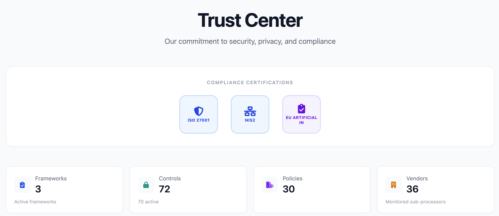

# Trust Portal for CISO Assistant

A public-facing trust center that pulls live data from your [CISO Assistant](https://github.com/intuitem/ciso-assistant-community) instance. Give your customers a clear view of your security posture without sharing spreadsheets or PDFs back and forth.



## What it does

- **Compliance** — shows your frameworks (ISO 27001, SOC 2, etc.) with real-time assessment progress based on your CISO Assistant Instnace 
- **Controls** — lists security controls and their implementation status
- **Risk posture** — high-level view of risk levels and treatment strategies
- **Sub-processors** — vendor/third-party listing pulled from CISO Assistant entities
- **Documents** — searchable policies, evidence, and certifications
- **Admin panel** (`/admin`) — customize branding, logo, colors, and footer text from the browser

Everything is read from the CISO Assistant API. No separate database needed.

## Quick start

```bash
cp .env.example .env
# fill in your CISO Assistant URL and API token

pnpm install
pnpm dev
```

Open `http://localhost:5173`.

## Docker

Pre-built images are published to GitHub Container Registry on every push to `main`:

```bash
docker run -p 3000:3000 --env-file .env ghcr.io/infosecflow/trust_portal_ciso_assistant:main
```

Or build it yourself:

```bash
docker build -t trust-portal .
docker run -p 3000:3000 --env-file .env trust-portal
```

## Configuration

All config lives in `.env`:

| Variable | What it does |
|---|---|
| `CISO_API_URL` | Your CISO Assistant API endpoint |
| `CISO_API_TOKEN` | API token for authentication |
| `PUBLIC_PORTAL_NAME` | Name shown in the header (fallback if not set via admin) |
| `PUBLIC_PORTAL_DESCRIPTION` | Tagline on the homepage |
| `ADMIN_PASSWORD` | Password for the `/admin` settings panel |

Branding (name, description, logo, colors) can also be managed from the `/admin` UI at runtime — those settings are stored in `data/portal-config.json` and take priority over env vars.

## Stack

SvelteKit · Tailwind CSS · Node adapter

## Demo
You could see the demo of trust portal on the link:
https://trust.infosecflow.com/

## License

[AGPLv3](LICENSE.md)
